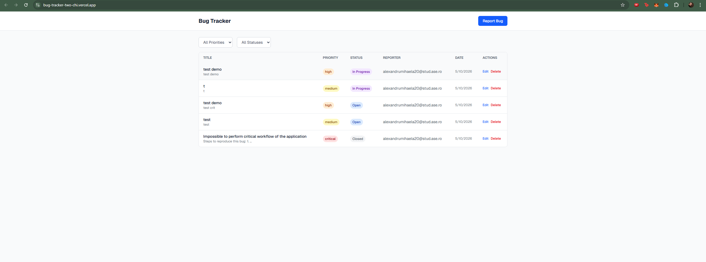
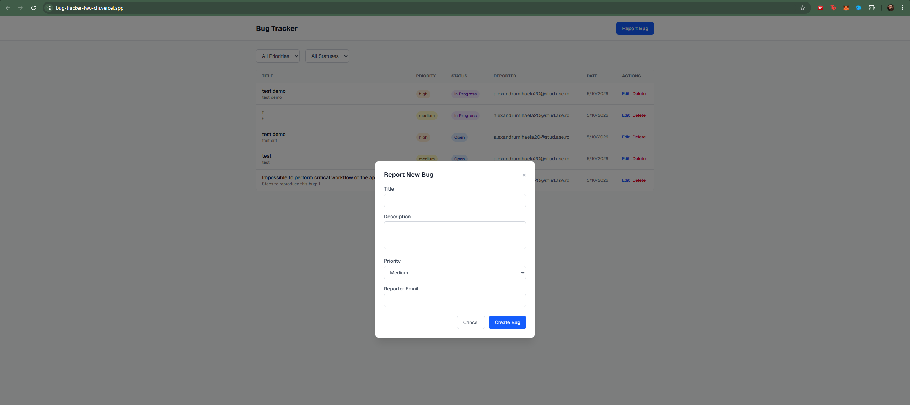
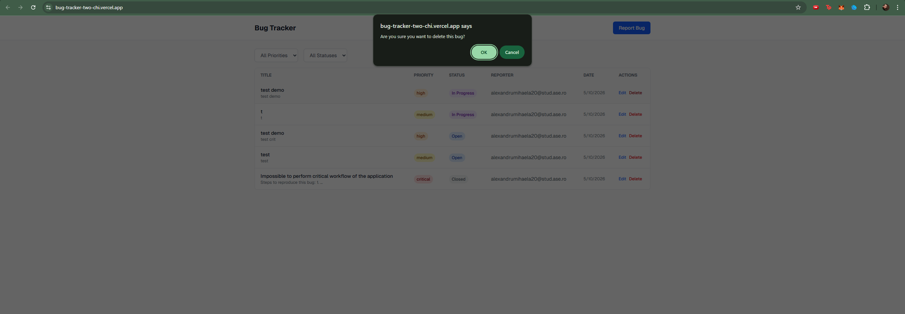
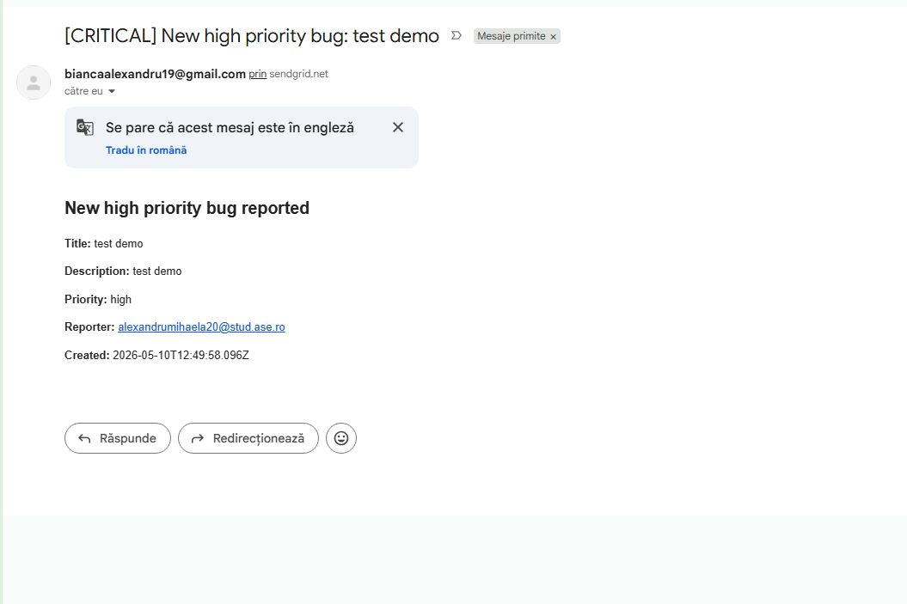

# Bug Tracker

**Alexandru Bianca-Mihaela, Grupa 1145**

## Link video prezentare proiect

[Prezentare Bug Tracker](https://drive.google.com/file/d/1kIIbixpp-493O3uY4qn_KbcCQgUWhHby/view?usp=sharing)

## Link publicare

[Bug Tracker - Vercel](https://bug-tracker-3ht6yjp10-biancamihaelas-projects.vercel.app/)

---

## 1. Introducere

Aplicația **Bug Tracker** este un instrument web pentru urmărirea și gestionarea defectelor software. Permite crearea, vizualizarea, editarea și ștergerea rapoartelor de bug-uri, cu notificări automate prin email pentru bug-uri critice și actualizări de status.

Proiectul utilizează două servicii cloud:
- **MongoDB Atlas** — baza de date în cloud pentru stocarea rapoartelor de bug-uri
- **SendGrid** — serviciu de email pentru notificări automate

## 2. Descriere problemă

În cadrul dezvoltării software, echipele au nevoie de un sistem centralizat pentru a raporta, prioritiza și urmări bug-urile descoperite. Fără un astfel de sistem, defectele se pierd, nu se prioritizează corect și nu există notificări automate pentru problemele critice.

Aplicația rezolvă această problemă oferind:
- Un dashboard centralizat pentru vizualizarea tuturor bug-urilor
- Sistem de priorități (low, medium, high, critical)
- Sistem de statusuri (open, in_progress, resolved, closed)
- Filtrare după prioritate și status
- Notificări email automate către admin pentru bug-uri critice/high
- Notificări email automate către reporter când statusul unui bug se schimbă

## 3. Descriere API

Aplicația expune un REST API cu următoarele endpoint-uri:

| Endpoint | Metodă | Descriere |
|----------|--------|-----------|
| `/api/bugs` | GET | Returnează lista tuturor bug-urilor (suportă filtrare prin query params) |
| `/api/bugs` | POST | Creează un bug nou |
| `/api/bugs/[id]` | GET | Returnează un bug specific după ID |
| `/api/bugs/[id]` | PUT | Actualizează un bug existent |
| `/api/bugs/[id]` | DELETE | Șterge un bug |

### Parametri de filtrare (GET /api/bugs)

| Parametru | Valori posibile |
|-----------|----------------|
| `priority` | `low`, `medium`, `high`, `critical` |
| `status` | `open`, `in_progress`, `resolved`, `closed` |

## 4. Flux de date

### Exemple de request / response

**GET /api/bugs**
```
Request: GET /api/bugs?priority=critical
Response: 200 OK
[
  {
    "_id": "6645a1b2c3d4e5f6a7b8c9d0",
    "title": "Login page crashes on mobile",
    "description": "App crashes when trying to login on iOS Safari",
    "priority": "critical",
    "status": "open",
    "reporterEmail": "dev@example.com",
    "createdAt": "2026-05-10T10:30:00.000Z",
    "updatedAt": "2026-05-10T10:30:00.000Z"
  }
]
```

**POST /api/bugs**
```
Request: POST /api/bugs
Content-Type: application/json
Body:
{
  "title": "Button not responding",
  "description": "Submit button on form does not trigger action",
  "priority": "high",
  "reporterEmail": "tester@example.com"
}

Response: 201 Created
{
  "_id": "6645a1b2c3d4e5f6a7b8c9d1",
  "title": "Button not responding",
  "description": "Submit button on form does not trigger action",
  "priority": "high",
  "status": "open",
  "reporterEmail": "tester@example.com",
  "createdAt": "2026-05-10T11:00:00.000Z",
  "updatedAt": "2026-05-10T11:00:00.000Z"
}
```

**PUT /api/bugs/[id]**
```
Request: PUT /api/bugs/6645a1b2c3d4e5f6a7b8c9d1
Content-Type: application/json
Body:
{
  "status": "resolved"
}

Response: 200 OK
{
  "_id": "6645a1b2c3d4e5f6a7b8c9d1",
  "title": "Button not responding",
  "description": "Submit button on form does not trigger action",
  "priority": "high",
  "status": "resolved",
  "reporterEmail": "tester@example.com",
  "createdAt": "2026-05-10T11:00:00.000Z",
  "updatedAt": "2026-05-10T12:00:00.000Z"
}
```

**DELETE /api/bugs/[id]**
```
Request: DELETE /api/bugs/6645a1b2c3d4e5f6a7b8c9d1
Response: 200 OK
{
  "deleted": "6645a1b2c3d4e5f6a7b8c9d1"
}
```

### Metode HTTP

| Metodă | Utilizare |
|--------|-----------|
| GET | Citirea datelor (lista de bug-uri sau un bug specific) |
| POST | Crearea unui bug nou |
| PUT | Actualizarea unui bug existent |
| DELETE | Ștergerea unui bug |

### Autentificare și autorizare servicii utilizate

- **MongoDB Atlas**: Conexiunea se realizează prin URI-ul `NEXT_ATLAS_URI` care conține credențialele (username/password) integrate în connection string-ul MongoDB. Accesul la cluster este restricționat prin Network Access (whitelist IP).
- **SendGrid**: Autorizarea se face prin `SENDGRID_API_KEY` — o cheie secretă generată din dashboard-ul SendGrid. Email-urile pot fi trimise doar de la adresa verificată în contul SendGrid (`SENDGRID_FROM_EMAIL`).

Toate cheile sensibile sunt stocate în variabile de mediu (`.env.local`) și nu sunt incluse în repository.

## 5. Capturi ecran aplicație





*Capturile de ecran sunt disponibile în folderul `screenshot/`.*

## 6. Referințe

- [Next.js Documentation](https://nextjs.org/docs)
- [MongoDB Atlas](https://www.mongodb.com/atlas)
- [SendGrid API Documentation](https://docs.sendgrid.com/api-reference)
- [Tailwind CSS](https://tailwindcss.com/docs)
- [Vercel Platform](https://vercel.com/docs)
- [Cloud Computing 2026 - SIMPRE](https://lungu-mihai-adrian.gitbook.io/cloud-computing-2026-simpre)
